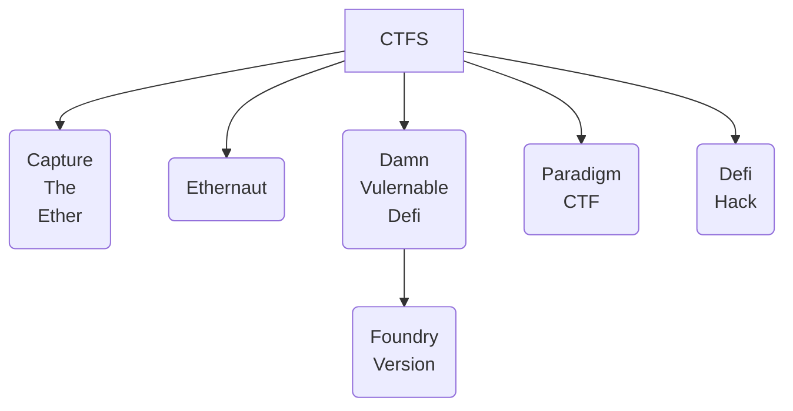

    

    

<h1> TOC </h1>

1. [What ?](#what-)
   1. [Repo Dir Strucutre](#repo-dir-strucutre)
2. [CTFS](#ctfs)
3. [Solutions](#solutions)
   1. [Tooling](#tooling)
4. [Warning](#warning)

# What ?

This repo will contain reports on CTF attempts

## Repo Dir Strucutre 

1. [sols](./sols/) - Solutions will be located here

# CTFS

> Reference resource for CTFS - [w3bs3c.com/ctfs](https://www.w3bs3c.com/ctfs)

Following table is in order of priority IMHO 

N | CTF Name| Cheats | Status   👠 = InProgress   ✅ = Complete
|:--:|:--:|:--:|:--:|
1 | [Ethernaut](https://ethernaut.openzeppelin.com/)   updated UI july 2022 | [blocksec-ctfs](https://github.com/blockthreat/blocksec-ctfs) , [Smart Contract Security Fundamentals- OpenZepplins Ethernaut Challenges - Youtube](https://www.youtube.com/playlist?list=PLBy3Qkuapv_7R1ZI_Cs2NOFn7ZTaNWY6G), [Stermi-Foundry-Ethernaut-Solutions](https://github.com/StErMi/foundry-ethernaut), [goncaloMagalhaes solutions](https://github.com/goncaloMagalhaes/ethernaut-foundry) |
2 | [Capture The Ether](https://capturetheether.com/) | [blocksec-ctfs](https://github.com/blockthreat/blocksec-ctfs) , [Smart Contract Security Fundamentals- OpenZepplins Ethernaut Challenges - Youtube](https://www.youtube.com/playlist?list=PLBy3Qkuapv_7R1ZI_Cs2NOFn7ZTaNWY6G) | 
3 | [Damn Vulnerable Defi](https://github.com/tinchoabbate/damn-vulnerable-defi)   [Damn Vulnerable Defi- Foundry Version](https://github.com/nicolasgarcia214/damn-vulnerable-defi-foundry) | [Damian Rusinek - (@drdr_zz)](https://github.com/damianrusinek/damn-vulnerable-defi) , DVD Foundry Solutions - Scattered - [JOP](https://plotchy.substack.com/p/solving-paradigmctfs-jop-?s=r) |
4 |  [Paradigm CTF 2022](https://ctf.paradigm.xyz/) - 2022 Version set for 20/8/2022 - 22/8/2022, [Paradigm CTF 2021](https://github.com/paradigm-operations/paradigm-ctf-2021) | [Paradigm CTF 2021 Solutions by cmichel](https://cmichel.io/paradigm-ctf-2021-solutions/) |
5 | [DeFi Hack](https://www.defihack.xyz/) - fork of Ethernau | | |

# Solutions 

Each one of the CTFS will be located in a separate directory under [sols](./sols/). 

## Tooling 

Unless otherwise indicated the following tool will be used 
1. [Foundry](https://github.com/foundry-rs/foundry) - Because all the testing can also be done with Soldity 
   1. [book](https://book.getfoundry.sh/) - Official Manual 

# Warning 

There is no guarantee the solutions are accurate. 

