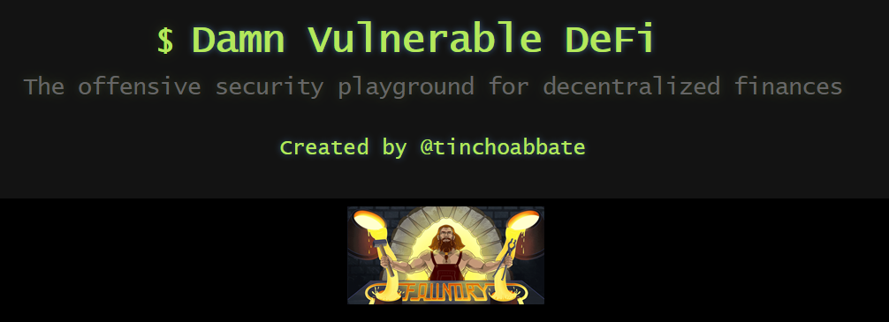

    

---

# TOC

1. [Description](#damn-vulnerable-defi---foundry-edition)

1.1 [Foundry Official Resources](#learning-resources-for-foundry)

2.

---

# Damn Vulnerable Defi - Foundry Edition

The following table is going to contain a detailed writeup of the solutions which are going to be done with [Foundry](https://book.getfoundry.sh/)

[Damn Vulnerable Defi - Foundry Edition](https://github.com/nicolasgarcia214/damn-vulnerable-defi-foundry)

## Learning Resources for Foundry

1. [Official Manual](https://book.getfoundry.sh/)
2. [Official Repo](https://github.com/foundry-rs/foundry)
3. [Awesome Foundry Resources](https://github.com/crisgarner/awesome-foundry)
4. [My Custom List](https://github.com/SkidsDAO/skidsdao.github.io/issues/1)
